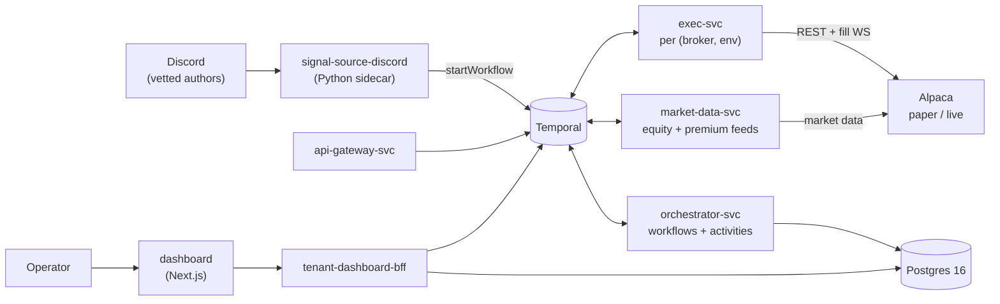

# oh-my-tradeagent

A multi-tenant **options trading automation platform**. It turns two kinds of
signal — copied trades from a vetted Discord channel, and price-level triggers
off a daily watchlist — into Alpaca orders, manages each open position to exit
through a Temporal-orchestrated risk pipeline, and gives the operator a Next.js
dashboard to watch and intervene.

The system trades **real money** on the homelab it runs on, so the whole design
leans fail-closed: kill switches, an account-wide loss cap, exit floors,
dual-control promotion gates, and an append-only audit ledger.

> **Detailed design:** [`docs/architecture.md`](docs/architecture.md) — system,
> Temporal, and deployment views with full Mermaid diagrams.

---

## How it fits together



Both strategy families converge on the same exit machinery: whatever opens a
position hands it to a **`PositionWorkflow`**, which owns that position until it
is flat.

### Copytrade

A Discord message from a whitelisted author becomes a
`CopytradeSignalPayload`, which starts a `CopytradeSignalWorkflow` (author +
freshness checks → risk/pre-trade checks → contract resolution → sizing → order
intent), which in turn spawns the `PositionWorkflow`. Sell-to-close messages
from the same author drive partial or full exits; `stc-intent-service`
classifies the close intent (full vs. fractional) from the message text.

A follow-up "escalation" cue from the author (`CopytradeDeriskWorkflow`) trims
the position to a keep-fraction and arms the trailing stop on the remainder.

### Watchlist trigger

A daily watchlist message becomes a `WatchlistTriggerSessionWorkflow` for one
`(tenant, strategy, et_date)`. It arms one child `WatchlistTriggerWorkflow` per
qualifying leg, each running a pure [`EntryStateMachine`](services/orchestrator/src/main/java/com/ohmytradeagent/orchestrator/domain/EntryStateMachine.java)
over the streaming equity feed:

- **`BREAKOUT`** — fires when the underlying first *crosses* the trigger level in
  the leg's direction, and skips the leg entirely if that first cross gaps past
  the chase band (`gap_tolerance_pct`).
- **`RETEST`** — arms on the break, then fires on a pull-back into the re-test
  zone, and skips if support is lost.

Both modes require a live cross (a leg already past its level at the first
observed tick never fires), are one-shot, and any leg that has not fired is
cancelled at the close. `WatchlistMirrorWorkflow` mirrors the verbatim watchlist
message to the tenant's Discord alert channel.

---

## Position lifecycle and exits

`PositionWorkflow` is the single owner of an open position. It reacts to broker
fills (`onFill`), streaming premium ticks, operator requests, and timers, and
can exit via:

| Exit | Driven by |
| --- | --- |
| Profit target / stop | `tp_ratio`, `sl_pct`, `tp_partial_fraction` |
| Chandelier trailing stop | `trail_giveback_pct`, `trail_on_partial` — armed automatically, by the de-risk cue, or by the operator |
| Time stop | `no_progress_time_stop_secs` |
| Exit floor | `exit_floor_abs` / `exit_floor_pct` / `expiry_day_floor` — stops feeding a dying contract back into the book |
| EOD / 0DTE flatten | `eod_force_flatten`, `force_close_eod_et`, `force_close_0dte_et`, `flatten_lead_minutes` |
| Kill-switch cascade | per-strategy `KillSwitchWorkflow` or tenant-wide `AccountKillSwitchWorkflow` |
| Operator action | `force_close` / `partial_close` / `arm_trail` Temporal Updates |

Order placement itself is defensive: entry orders have a per-environment TTL
(`pending_ttl_paper_secs` / `pending_ttl_live_secs`), one bounded re-peg
(`repeg_after_ms`, `repeg_ceiling_pct`), slippage ceilings, and a reprice ladder
on the exit side (`exit_reprice_steps`, `exit_reprice_tick`). Fills arrive over
the Alpaca trade-updates WebSocket with a TTL reconcile as the backstop — see
[`docs/ops/fill-listener.md`](docs/ops/fill-listener.md).

Positions the broker holds but no workflow owns are picked up by
`ReconciliationWorkflow` + `AdoptionWorkflow`, so a restart or a manual broker
action does not leave an unmanaged position.

---

## Risk controls

- **Entry gates** — the risk Activity runs per-order gates (author whitelist,
  signal age, kill-switch state, `max_positions`) and then six opt-in
  portfolio-level sub-gates: `notional_cap_pct_of_capital_base`,
  `same_underlying_count`, `sector_concentration_cap`, `daily_trade_count`,
  `drawdown_velocity_threshold`, and the broker buying-power / routability probe
  behind `pre_trade_check_enabled`. Each is null-to-disable, and every gate fails
  **closed** — a kill-switch query timeout or broker outage rejects the entry
  rather than letting it through.
- **Sizing** — `capital_weight` against a `capital_source` of `static` or
  `account_cash`, clamped to `min_contracts` / `max_contracts`, with an optional
  scale-in reduction (`entry_scale_in_fraction`).
- **Per-strategy kill switch** — `KillSwitchWorkflow`, tripped by
  `daily_loss_threshold`, with a reset cooldown.
- **Account loss cap** — one `AccountKillSwitchWorkflow` per tenant covering
  *every* strategy on the shared `broker_target`. Each heartbeat sums tenant-wide
  realized P&L plus open mark-to-market and auto-trips at
  `-account_daily_loss_threshold`, market-flattening every running
  `PositionWorkflow`. The cap is a **tenant-level** setting
  (`account_daily_loss_threshold` / `account_daily_loss_pct` on `tenant_config`),
  not a strategy field; it is inert until set, and edits are tighten-only.
  Posture: [`docs/ops/account-loss-cap-posture.md`](docs/ops/account-loss-cap-posture.md).
- **Audit ledger** — every lifecycle decision is an append-only `audit_event`;
  `services/audit/` derives the ledger, and the `exec` service owns the
  `order_intent_journal` (per `(broker, env)` database).
- **Alerting** — per-tenant Discord webhooks (`alert_webhook_url`,
  `floor_breach_alert_pct`) plus broker-rejection and cap alerters.

---

## Operator surface

The Next.js dashboard is the control plane. Pages:

| Page | What it does |
| --- | --- |
| `/live` | The intervention console: open positions with live marks, entry-proximity for armed watchlist legs, trail liveness, floor-breach badges, and the action buttons — **Force exit**, **Trim** (reduce-only), **Stop loss**, **Arm trail**, and **Manual entry** (hand-typed BTO with a quote preview). |
| `/positions`, `/orders`, `/trades` | History and current state per tenant. |
| `/portfolio` | Account value chart and portfolio history. |
| `/config` | Per-strategy config editor. The field universe is **generated** from the JSON Schema, so a schema change auto-appears here. |
| `/status` | Kill-switch state, account guard, reset (with open exposure + MTM shown before you reset). |
| `/options-chat` | Read-only mirror of the source Discord channel, rendered with Discord markdown + media. |
| `/admin/tenants`, `/admin/onboard` | Operator onboarding: create a tenant, arm its caps, bind broker credentials, invite users, de-provision. |
| `/settings`, `/signin` | Tenant switcher; Google OAuth. |

Operator writes reach the workflows as Temporal **Updates** (validated,
auditable) through the BFF — never as direct DB edits.

> Two operator footguns worth knowing before you click: a one-click
> **Deactivate** trips the kill switch and force-flattens open positions, and
> saving `/config` on a live strategy halts new entries until you re-Activate.
> See [`scripts/ops/README.md`](scripts/ops/README.md) and `docs/ops/`.

---

## Multi-tenancy

One worker fleet serves every tenant; tenant identity is resolved per signal and
per request, never per deployment.

- **Config** lives in Postgres (`tenant_config`, strategy config rows), edited
  through `TenantConfigUpdateWorkflow` / `StrategyConfigUpdateWorkflow` —
  tighten-only where a loosened value would raise risk. The per-tenant YAML under
  `tenants/` is still mounted as a ConfigMap because boot-time enum + seeding
  scans read it.
- **Broker credentials** are envelope-encrypted in a Postgres column (not k8s
  Secrets, not Vault), resolved per tenant at order time, with an account-identity
  probe that refuses to trade an account whose number does not match the declared
  one.
- **Tenant lifecycle** is workflow-driven end to end:
  `LiveActivationWorkflow` / `LiveDeactivationWorkflow` for the live gate,
  `TenantDeleteWorkflow` for guarded de-provisioning (it cannot touch a live
  tenant), `BrokerCredentialAuditWorkflow` for credential hygiene.
- Onboarding a live copytrade tenant has a runbook:
  [`docs/ops/live-copytrade-tenant-onboarding-runbook.md`](docs/ops/live-copytrade-tenant-onboarding-runbook.md).

---

## Repository layout

| Path | What lives there |
| --- | --- |
| `contract/` | Cross-language source of truth: JSON Schemas → Java DTOs (`jsonschema2pojo`) + Python DTOs. Also `fixtures/`. |
| `services/orchestrator/` | Temporal workflows + most activities (Java 21 / Spring Boot). The brain. |
| `services/exec/` | Broker adapters; one deployment per `(broker, env)`; owns the `order_intent_journal` and the fill listener. |
| `services/market-data/` | Quote, equity-tick, and option-premium subscription activities; feed-health endpoint. |
| `services/api-gateway/` | REST surface: audit, positions, kill switch, promotion, watchlist fan-out. |
| `services/audit/` | Audit-ledger derivation (CLI / CronJob). |
| `services/tenant-dashboard-bff/` | Backend-for-frontend the dashboard reads and writes through. |
| `services/signal-source-discord/` | Python sidecar: Playwright reads Discord (signals, watchlist, chat mirror) and starts workflows. |
| `services/stc-intent-service/` | Python service: classifies STC (sell-to-close) intent for close handling. |
| `dashboard/` | Next.js operator/tenant dashboard (see [`dashboard/README.md`](dashboard/README.md)). |
| `mobile/` | Expo mobile app (paused epic). |
| `tenants/` | Per-tenant + per-strategy YAML, mounted as ConfigMaps. |
| `infra/` | Docker Compose, k8s manifests (`infra/k8s/`), Temporal, Postgres init, Prometheus/OTel. |
| `scripts/` | Dev wrappers (`scripts/dev/`), operator tooling ([`scripts/ops/`](scripts/ops/README.md)), prod watchdogs, broker/feed probes, `scripts/data/` (bar + psql helpers) and `scripts/research/` (latency + quote-rate analysis). |
| `docs/` | Architecture, development, flows, ops runbooks, plans, PRDs, research. |
| `references/` | Vendored third-party reference code, read-only ([`references/README.md`](references/README.md)). |

---

## Tech stack

- **Core services:** Java 21 · Spring Boot 3.4 · Temporal SDK 1.27 · jOOQ · Maven (multi-module `pom.xml`).
- **Python services:** Python 3.12 · Playwright · Temporal Python client · `uv`.
- **Dashboard:** Next.js · TypeScript · NextAuth (Google OAuth).
- **State:** Temporal 1.27 (workflow history) · Postgres 16 (`orchestrator` + `exec_*` databases) · Redis (positionWorkflowId cache).
- **Deployment:** k3s on the homelab; Prometheus + OpenTelemetry for observability.

---

## Local development

Repo-level convenience targets live in the [`Makefile`](Makefile) — thin DX
wrappers, not a parallel build system (language builds stay in Maven / `uv` /
npm). Run `make help` for the full list.

```sh
make hooks           # install local git hooks (schema-regen + audit-kind guards). Run once after clone.
make dashboard-dev   # tenant dashboard end-to-end locally (compose infra + BFF + Next.js, passwordless dev login)
make config-edit-dev # dashboard-dev + orchestrator + api-gateway so /config can SAVE strategy config locally
make onboard-dev     # config-edit stack with operator onboarding routes un-darked (/admin/onboard)
make dashboard-seed  # insert sample trades/orders into local Postgres so the dashboard shows data
make local-up        # full local pipeline in Docker (infra + sidecar + orchestrator/exec/market-data)
make local-down      # stop the local pipeline (volumes kept)
```

`make local-up` needs `infra/.env.local` (`cp infra/.env.local.example
infra/.env.local` and fill it in). See [`docs/development.md`](docs/development.md)
for the git hooks and the `--no-verify` escape hatches, and
[`docs/ops/local-dev.md`](docs/ops/local-dev.md) for the local stack layout.

---

## Contracts & code generation

`contract/` is the cross-language boundary. One schema edit regenerates **three**
artifacts:

1. **Java DTOs** — `jsonschema2pojo` at Maven build.
2. **Python DTOs** — [`contract/python/regen.sh`](contract/python/regen.sh).
3. **The dashboard `/config` field manifest** —
   [`scripts/gen-config-field-manifest.py`](scripts/gen-config-field-manifest.py)
   writes `dashboard/lib/strategyConfigFields.generated.ts` from
   `contract/schemas/strategy-config.json`.

The `pre-commit` hook installed by `make hooks` fails if the regenerated
artifacts drift from an edited schema; CI enforces the same. Never hand-edit
generated DTOs or the manifest — edit the schema and regen.

Workflow code is **replay-safe by contract**: a change to an existing workflow's
command flow is version-gated (`Workflow.getVersion`), and new behavior
generally arrives as a new workflow type, a new signal handler, or a Temporal
Update rather than as an edit to a running command sequence.

---

## Deployment

The production target is the homelab k3s cluster (`ssh ridopark@192.168.10.123`).
Manifests are under `infra/k8s/`. Two things to know:

- A CI deploy only applies **per-service** manifests. Shared manifests (the
  tenants ConfigMap, secrets, ServiceMonitors, CronJobs) still need a manual
  `kubectl apply`.
- Because images are pulled by tag, a node reboot re-pulls the estate onto the
  newest `main` with no deploy run. Trust the image **digest**, not deploy
  timestamps, when you ask "what is actually running?".

The public dashboard is fronted by a Cloudflare Tunnel + Access edge gate;
onboarding a user takes **two** allowlists (the edge gate and the dashboard
invite) — see [`scripts/ops/README.md`](scripts/ops/README.md).

---

## Documentation

- [`docs/architecture.md`](docs/architecture.md) — system / Temporal / deployment views.
- [`docs/development.md`](docs/development.md) — git hooks, local workflow.
- `docs/flows/` — end-to-end flow write-ups (e.g. [`bto-stc-flow.html`](docs/flows/bto-stc-flow.html)).
- `docs/ops/` — operator runbooks: promotion/rollback, kill-switch-stuck,
  fill listener, reconciliation metrics, drift checks, RTO/RPO, drill log.
- `docs/plans/` — phased remediation/feature plans, one per epic, plus
  [`docs/plans/experiments/`](docs/plans/experiments/README.md) for strategy
  experiments.
- `docs/prd/`, `docs/research/` — product and research docs.
