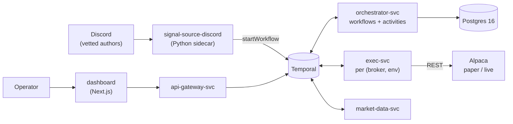

# oh-my-tradeagent

A multi-tenant **copytrade automation platform**. It ingests options trade
signals from a vetted Discord channel, runs them through a Temporal-orchestrated
risk/execution pipeline, places and manages the orders on Alpaca (paper or live),
and surfaces everything through a Next.js operator dashboard.

The system is designed to trade **real money** on the homelab it runs on, so the
whole design leans fail-closed: kill switches, account loss caps, dual-control
promotion gates, and an append-only audit ledger.

> **Detailed design:** [`docs/architecture.md`](docs/architecture.md) — system,
> Temporal, and deployment views with full Mermaid diagrams.

---

## How it fits together



A signal becomes a `CopytradeSignalPayload`, which starts a
`CopytradeSignalWorkflow` (risk checks → contract resolution → order intent) that
in turn spawns a `PositionWorkflow` managing the open position to exit
(targets, trailing stop, time stop, EOD flatten, kill-switch flatten).

---

## Repository layout

| Path | What lives there |
| --- | --- |
| `contract/` | Cross-language source of truth: JSON Schemas → Java DTOs (`jsonschema2pojo`) + Python DTOs. Also `fixtures/`. |
| `services/orchestrator/` | Temporal workflows + most activities (Java 21 / Spring Boot). The brain. |
| `services/exec/` | Broker adapters; one deployment per `(broker, env)`; owns the `order_intent_journal`. |
| `services/market-data/` | Quote/stream activities. |
| `services/api-gateway/` | REST surface: audit, positions, kill switch, promotion. |
| `services/audit/` | Phase 7 audit-ledger derivation (CLI / CronJob). |
| `services/tenant-dashboard-bff/` | Backend-for-frontend the dashboard reads from. |
| `services/signal-source-discord/` | Python sidecar: Playwright reads Discord, starts workflows. |
| `services/stc-intent-service/` | Python service: classifies STC (sell-to-close) intent for close handling. |
| `dashboard/` | Next.js operator/tenant dashboard (see [`dashboard/README.md`](dashboard/README.md)). |
| `mobile/` | Expo mobile app (paused epic). |
| `tenants/` | Per-tenant + per-strategy YAML, mounted as ConfigMaps. |
| `infra/` | Docker Compose, k8s manifests (`infra/k8s/`), Temporal, Postgres init, Prometheus/OTel. |
| `scripts/` | Dev wrappers (`scripts/dev/`) and operator tooling ([`scripts/ops/`](scripts/ops/README.md)). |
| `docs/` | Architecture, development, flows, ops runbooks, plans, PRDs, research. |

---

## Tech stack

- **Core services:** Java 21 · Spring Boot 3.4 · Temporal SDK 1.27 · jOOQ · Maven (multi-module `pom.xml`).
- **Signal sidecar:** Python 3.12 · Playwright · Temporal Python client · `uv`.
- **Dashboard:** Next.js · TypeScript · NextAuth (Google OAuth).
- **State:** Temporal 1.27 (workflow history) · Postgres 16 (`orchestrator` + `exec_*` schemas) · Redis (positionWorkflowId cache).
- **Deployment:** k3s on the homelab; Prometheus + OpenTelemetry for observability.

---

## Local development

Repo-level convenience targets live in the [`Makefile`](Makefile) — thin DX
wrappers, not a parallel build system (language builds stay in Maven / `uv` /
npm). Run `make help` for the full list.

```sh
make hooks           # install local git hooks (schema-regen + audit-kind guards). Run once after clone.
make dashboard-dev   # tenant dashboard end-to-end locally (compose infra + BFF + Next.js, passwordless dev login)
make config-edit-dev # dashboard-dev + orchestrator + api-gateway so /config can SAVE strategy config locally
make onboard-dev     # config-edit stack with operator onboarding routes un-darked (/admin/onboard)
make dashboard-seed  # insert sample trades/orders into local Postgres so the dashboard shows data
make local-up        # full local pipeline in Docker (infra + sidecar + orchestrator/exec/market-data)
make local-down      # stop the local pipeline (volumes kept)
```

`make local-up` needs `infra/.env.local` (`cp infra/.env.local.example
infra/.env.local` and fill it in). See [`docs/development.md`](docs/development.md)
for the git hooks and the `--no-verify` escape hatches.

---

## Contracts & code generation

`contract/` is the cross-language boundary. JSON Schemas under
`contract/schemas/` generate Java DTOs (via `jsonschema2pojo` at Maven build) and
Python DTOs (via `contract/python/regen.sh`). The `pre-commit` hook installed by
`make hooks` fails if the regenerated Python models drift from an edited schema;
CI enforces the same. Never hand-edit generated DTOs — edit the schema and regen.

---

## Deployment

The production target is the homelab k3s cluster (`ssh ridopark@192.168.10.123`).
Manifests are under `infra/k8s/`. Note that a CI deploy only applies
per-service manifests — shared manifests (tenants ConfigMap, secrets, etc.)
require a manual `kubectl apply`. The public dashboard is fronted by a Cloudflare
Tunnel + Access edge gate; onboarding a user takes **two** allowlists (the edge
gate and the dashboard invite) — see [`scripts/ops/README.md`](scripts/ops/README.md).

---

## Documentation

- [`docs/architecture.md`](docs/architecture.md) — system / Temporal / deployment views.
- [`docs/development.md`](docs/development.md) — git hooks, local workflow.
- `docs/flows/` — end-to-end flow write-ups.
- `docs/ops/` — operator runbooks (promotion, rollback, drills).
- `docs/plans/`, `docs/prd/`, `docs/research/` — planning and product docs.
