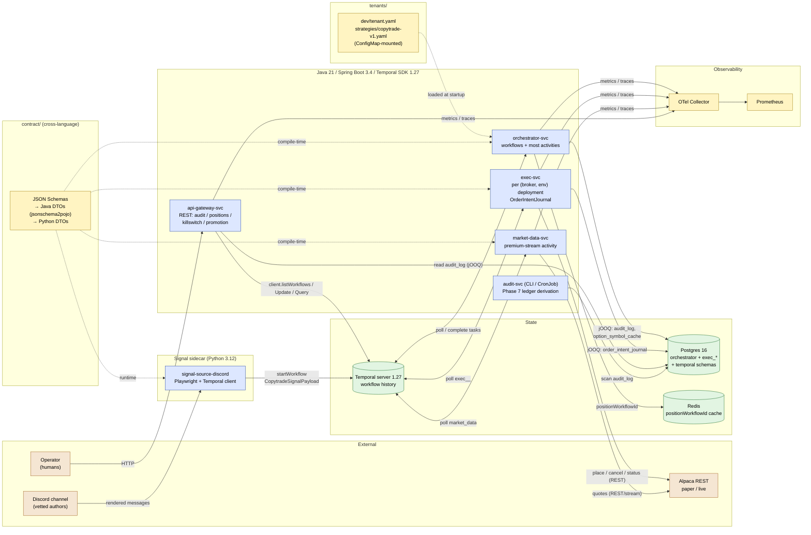
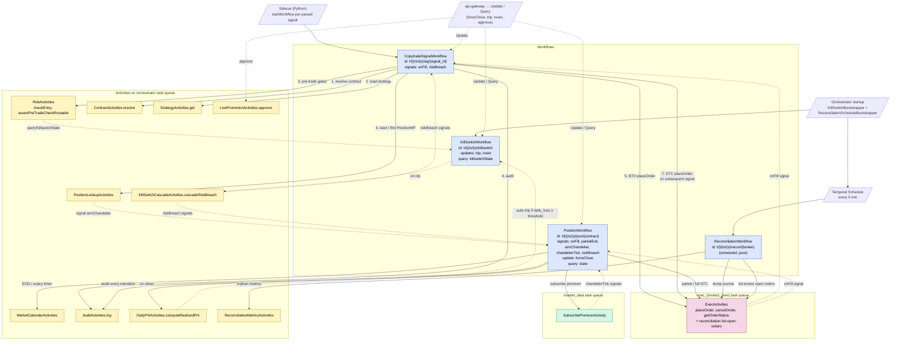
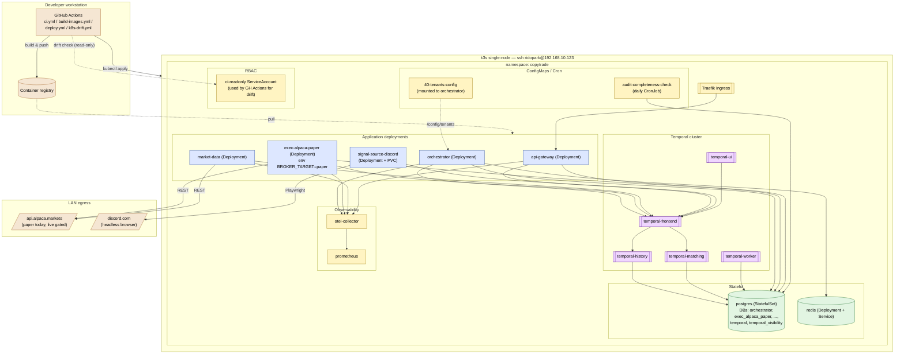

# oh-my-tradeagent — Architecture

Three views of what's built today on `main`, cross-referenced against `docs/prd/PRD.md`,
the Temporal code under `services/orchestrator/`, the broker adapters under `services/exec/`,
the schemas under `contract/`, and the k8s manifests under `infra/k8s/`.

- **System view** — components, languages, and the data/control edges between them.
- **Temporal view** — workflows, activities, signals, updates, and the queues they run on.
- **Deployment view** — how the system lands on the homelab k3s cluster.

---

## 1. System architecture

**Notes on the edges**

- The sidecar never calls a broker directly and never holds dedupe state for correctness —
  Temporal `WorkflowIDReusePolicy=REJECT_DUPLICATE` on `t-{tenant}/s-{strategy}/sig/{signal_id}` is
  the dedupe boundary (`docs/prd/PRD.md` §SignalDedupe).
- `orchestrator-svc` runs **most** activities (risk, audit, contract, strategy, market-calendar,
  daily-pnl, reconciliation-metrics, killswitch-cascade, live-promotion); `exec-svc` and
  `market-data-svc` host theirs on their own task queues and poll Temporal independently.
- `api-gateway-svc` carries no Temporal worker — it's a thin REST front for Temporal client +
  jOOQ reads on `audit_log`.

---

## 2. Temporal workflow view

**Key invariants the diagram encodes**

- `RiskActivities.checkEntry` reads `KillSwitchWorkflow` state via Query — it does not hold local
  kill-switch state. That's why the dotted line goes from `A_RISK` back to `KSW`.
- `exec-svc` is deployed once per `(broker, env)` and polls a queue named
  `exec_{broker}_{env}` (e.g. `exec_alpaca_paper`). The orchestrator picks the queue from
  `StrategyConfig.broker_target`, which is how a strategy gets routed paper-vs-live.
- `OrderIntentJournal` writes happen **before** the broker call inside the exec activity
  (`PRD.md` §OrderIntentJournal). The diagram simplifies that into one arrow.
- Trip cascade is async-by-design: `cascadeRiskBreach` fires `riskBreach` signals to every
  affected `PositionWorkflow` and `CopytradeSignalWorkflow`, which decide locally what to do.

---

## 3. Deployment topology (homelab k3s)

**What this view omits intentionally**

- Only `exec-alpaca-paper` is drawn. The manifest set is structured so additional
  `(broker, env)` deployments (e.g. `exec-alpaca-live`, `exec-tradier-paper`) are added by
  copying `52-exec-alpaca-paper.yaml` and pointing it at a separate Postgres DB on the same
  StatefulSet. Live promotion is gated by `LivePromotionActivities.approve` (Phase 7).
- The Temporal-cluster boxes are drawn because Temporal is still the runtime topology, but it
  runs in the **`temporal` namespace**, not `copytrade`. The old in-`copytrade` manifests
  (`30-temporal.yaml`, `31-temporal-bootstrap.yaml`) were deprecated in Phase 5b.E and deleted
  on 2026-08-17; nothing in `infra/k8s/` creates a Temporal cluster today.
- Local-dev `infra/docker-compose.yml` is not shown; it mirrors the k8s view minus
  ingress + RBAC.

---

## Reading order for new contributors

1. `docs/prd/PRD.md` — why this shape, not a monolith.
2. Diagram §1 above — what services exist.
3. Diagram §2 — the workflow that actually executes a copytrade signal end-to-end.
4. `services/orchestrator/src/main/java/com/ohmytradeagent/orchestrator/workflows/CopytradeSignalWorkflow.java` —
   the single best file to anchor §2 in real code.
5. Diagram §3 — how it lands on the homelab.
