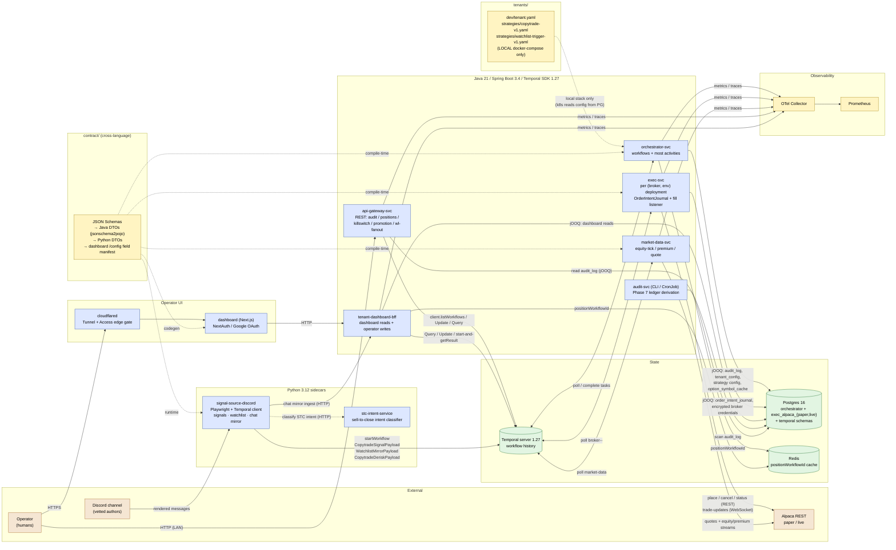

# oh-my-tradeagent — Architecture

Three views of what's built today on `main`, cross-referenced against `docs/prd/PRD.md`,
the Temporal code under `services/orchestrator/`, the broker adapters under `services/exec/`,
the schemas under `contract/`, the dashboard + BFF under `dashboard/` and
`services/tenant-dashboard-bff/`, and the k8s manifests under `infra/k8s/`.

- **System view** — components, languages, and the data/control edges between them.
- **Temporal view** — workflows, activities, signals, updates, and the queues they run on.
- **Deployment view** — how the system lands on the homelab k3s cluster.

Two strategy families feed the same execution core: **copytrade** (mirror a vetted
Discord author's options trades) and **watchlist-trigger** (arm price levels off a
daily watchlist post and enter on a confirmed cross). Both converge on one
`PositionWorkflow` per open position, which is the only owner of an exit.

---

## 1. System architecture

**Notes on the edges**

- The sidecar never calls a broker directly and never holds dedupe state for correctness —
  Temporal `WorkflowIDReusePolicy=REJECT_DUPLICATE` on `t-{tenant}/s-{strategy}/sig/{signal_id}` is
  the dedupe boundary (`docs/prd/PRD.md` §SignalDedupe). The watchlist mirror and the de-risk cue
  use the same policy on their own id shapes (`/watchlist/{source_message_id}`, `/derisk/{signal_id}`).
- The same sidecar image is deployed three times with different env: the signal reader, the
  watchlist/chat reader, and the options-chat mirror that POSTs into the BFF. Only the signal and
  watchlist roles start workflows.
- `orchestrator-svc` runs **most** activities (risk, audit, contract, strategy, market-calendar,
  daily-pnl, reconciliation-metrics, killswitch-cascade, live-promotion, watchlist parse/trigger,
  tenant + strategy config writes); `exec-svc` and `market-data-svc` host theirs on their own task
  queues and poll Temporal independently.
- `api-gateway-svc` carries no Temporal worker — it's a thin REST front for Temporal client +
  jOOQ reads on `audit_log`. `tenant-dashboard-bff` is the dashboard's only backend: it reads
  through jOOQ + Temporal Queries and performs **operator writes as Temporal Updates**, never as
  direct DB edits to live state.
- Broker credentials are envelope-encrypted in Postgres and resolved per tenant inside `exec-svc`
  at order time. No credential reaches the orchestrator, the BFF, or the dashboard.

---

## 2. Temporal workflow view

```mermaid
flowchart TB
    %% ============ Triggers ============
    SIDECAR[/"Sidecar (Python)<br/>startWorkflow per parsed<br/>signal / watchlist post / cue"/]
    BOOT[/"Orchestrator startup<br/>KillSwitchBootstrapper +<br/>ReconciliationScheduleBootstrapper"/]
    SCHED[/"Temporal Schedule<br/>every 5 min"/]
    OPS[/"BFF / api-gateway → Update / Query<br/>(force_close, partial_close, arm_trail,<br/>trip, reset, approve)"/]

    %% ============ Workflows ============
    subgraph WF["Trading workflows"]
        CSW["CopytradeSignalWorkflow<br/>id: t-{t}/s-{s}/sig/{signal_id}<br/>signals: onFill, riskBreach<br/>query: entryStatus"]
        DRK["CopytradeDeriskWorkflow<br/>id: t-{t}/s-{s}/derisk/{signal_id}<br/>trim + arm trail on author cue"]
        WSESS["WatchlistTriggerSessionWorkflow<br/>id: t-{t}/s-{s}/wl/{et_date}/session<br/>fan-out ≤ 64 legs, EOD cancel sweep"]
        WLEG["WatchlistTriggerWorkflow (child)<br/>id: …/wl/{et_date}/{ticker}/{right}<br/>signals: equityTick, onFill, cancel<br/>query: entryProximity"]
        WMIR["WatchlistMirrorWorkflow<br/>id: t-{t}/s-{s}/watchlist/{msg_id}<br/>+ WatchlistDigestMarkerWorkflow (dedupe)"]
        POS["PositionWorkflow<br/>id: t-{t}/s-{s}/pos/{occ}/{entry_signal_id}<br/>signals: onFill, partialExit, armChandelier,<br/>chandelierTick, riskBreach, supersede<br/>updates: force_close, partial_close, arm_trail<br/>queries: state, exit/entry proximity"]
        KSW["KillSwitchWorkflow<br/>id: t-{t}/s-{s}/killswitch<br/>updates: trip, reset<br/>query: killswitchState"]
        AKSW["AccountKillSwitchWorkflow<br/>id: t-{t}/account/killswitch<br/>ONE per tenant, spans strategies"]
        REC["ReconciliationWorkflow<br/>id: t-{t}/s-{s}/recon/{broker}<br/>(scheduled, pure)"]
        ADOPT["AdoptionWorkflow<br/>re-attach a confirmed orphan lot"]
    end

    %% ============ Activities (grouped) ============
    subgraph ACT_ORCH["Activities on orchestrator task queue"]
        A_RISK["RiskActivities.checkEntry<br/>+ 6 opt-in portfolio sub-gates"]
        A_CONTRACT["ContractActivities.resolve"]
        A_STRAT["StrategyActivities.get"]
        A_CAL["MarketCalendarActivities"]
        A_AUDIT["AuditActivities.log"]
        A_PNL["DailyPnlActivities.computeRealizedPnl"]
        A_LOOK["PositionLookupActivities"]
        A_RECMET["ReconciliationMetricsActivities"]
        A_CASC["KillSwitch + AccountKillSwitch<br/>CascadeActivities"]
        A_ACCT["AccountPnlActivities<br/>computeTenantRealizedPnl + accountOpenBook"]
        A_PROMO["LivePromotionActivities.approve"]
        A_WL["WatchlistParser / WatchlistMirrorActivities<br/>WatchlistTriggerActivities + entry decider"]
    end

    subgraph ACT_EXEC["broker-{broker}-{env} task queue"]
        A_EXEC["ExecActivities<br/>placeOrder, cancelOrder, getOrderStatus<br/>+ reconciliation / account / portfolio reads"]
    end

    subgraph ACT_MD["market-data task queue"]
        A_MD["SubscribePremiumActivity<br/>SubscribeEquityActivity<br/>GetOptionQuoteActivity"]
    end

    %% ============ Edges ============
    SIDECAR --> CSW
    SIDECAR --> WMIR
    SIDECAR --> DRK
    BOOT --> KSW
    BOOT --> AKSW
    BOOT --> SCHED
    SCHED --> REC
    OPS -. "Update / Query" .-> POS
    OPS -. "Update / Query" .-> KSW
    OPS -. "Update / Query" .-> AKSW
    OPS -. "start" .-> ADOPT

    %% CSW flow
    CSW -->|"1. resolve contract"| A_CONTRACT
    CSW -->|"2. load strategy"| A_STRAT
    CSW -->|"3. entry gates"| A_RISK
    A_RISK -. "queryKillswitchState" .-> KSW
    CSW -->|"4. audit"| A_AUDIT
    CSW -->|"5. BTO placeOrder"| A_EXEC
    A_EXEC -. "onFill signal" .-> CSW
    CSW -->|"6. start / find PositionWF"| A_LOOK
    A_LOOK -. "child / signal" .-> POS
    CSW -->|"7. STC placeOrder<br/>on subsequent signal"| A_EXEC

    %% Watchlist flow
    WMIR -->|"post alert + parse"| A_WL
    A_WL -. "start session (if parse clean)" .-> WSESS
    WSESS -->|"arm one child per leg"| WLEG
    WLEG -->|"subscribe equity"| A_MD
    A_MD -. "equityTick signals" .-> WLEG
    WLEG -->|"on FIRE: gates + BTO"| A_RISK
    WLEG -->|"placeOrder"| A_EXEC
    A_EXEC -. "onFill signal" .-> WLEG
    WLEG -->|"on fill: spawn child PositionWF"| POS
    WSESS -. "cancel un-fired legs at close" .-> WLEG

    %% De-risk cue
    DRK -. "partialExit + armChandelier" .-> POS

    %% Position flow
    POS -->|"subscribe premium"| A_MD
    A_MD -. "chandelierTick signals" .-> POS
    POS -->|"partial / full STC"| A_EXEC
    A_EXEC -. "onFill signal" .-> POS
    POS -->|"EOD / expiry timer"| A_CAL
    POS -->|"audit every transition"| A_AUDIT

    %% Reconciliation + adoption
    REC -->|"dump journal"| A_EXEC
    REC -->|"list broker open orders"| A_EXEC
    REC -->|"orphan metrics"| A_RECMET
    ADOPT -->|"broker truth"| A_EXEC
    ADOPT -. "reconstruct owner" .-> POS

    %% KillSwitch cascade
    KSW -. "on trip" .-> A_CASC
    AKSW -. "on trip (account-wide)" .-> A_CASC
    A_CASC -. "riskBreach signals" .-> POS
    A_CASC -. "riskBreach signals" .-> CSW

    %% Daily PnL
    POS -->|"on close"| A_PNL
    A_PNL -. "auto-trip if daily_loss ≥ threshold" .-> KSW
    AKSW -->|"heartbeat: realized + open MTM"| A_ACCT

    %% Live promotion
    OPS -. "approve" .-> A_PROMO

    classDef wf fill:#dde7ff,stroke:#3554a8,color:#000;
    classDef act fill:#fff4c2,stroke:#a8881e,color:#000;
    classDef act2 fill:#f5d6e6,stroke:#a83576,color:#000;
    classDef act3 fill:#d6f5e6,stroke:#2e8a5a,color:#000;
    class CSW,DRK,WSESS,WLEG,WMIR,POS,KSW,AKSW,REC,ADOPT wf;
    class A_RISK,A_CONTRACT,A_STRAT,A_CAL,A_AUDIT,A_PNL,A_LOOK,A_RECMET,A_CASC,A_ACCT,A_PROMO,A_WL act;
    class A_EXEC act2;
    class A_MD act3;
```

**Key invariants the diagram encodes**

- `RiskActivities.checkEntry` reads `KillSwitchWorkflow` state via Query — it does not hold local
  kill-switch state. That's why the dotted line goes from `A_RISK` back to `KSW`. Every gate fails
  **closed**: a query timeout rejects the entry (`KILL_SWITCH_UNAVAILABLE`).
- `exec-svc` is deployed once per `(broker, env)` and polls a queue named
  `broker-{broker}-{env}` (e.g. `broker-alpaca-paper`, `broker-alpaca-live`) — note the queue name
  uses dashes and is *not* the same string as the per-env database `exec_alpaca_paper`. The
  orchestrator picks the queue from `StrategyConfig.broker_target`, which is how a strategy gets
  routed paper-vs-live.
- `OrderIntentJournal` writes happen **before** the broker call inside the exec activity
  (`PRD.md` §OrderIntentJournal). The diagram simplifies that into one arrow.
- Trip cascade is async-by-design: `cascadeRiskBreach` fires `riskBreach` signals to every
  affected `PositionWorkflow` and `CopytradeSignalWorkflow`, which decide locally what to do. The
  account-level cascade is scoped to the tenant's `broker_target` and spans **every** strategy.
- A watchlist leg is one-shot and self-cancelling: the child either FIREs once, SKIPs definitively,
  or is cancelled by the parent's EOD sweep. The session is keyed on `et_date`, so a same-day
  re-post of the watchlist is idempotent via `REJECT_DUPLICATE`. In the child id, `{right}` is the
  option right — `C` or `P` — so one ticker can carry at most one call leg and one put leg per day.
- `PositionWorkflow` is the convergence point. Whatever opened the position — copytrade signal,
  watchlist leg, operator manual entry, or adoption of an orphan — the exit path is the same one.
- Anything a Temporal *client* needs from a broker has to go through a short-lived workflow, because
  a task-queue-pinned activity stub can only be created inside a workflow. That is why
  `AccountSnapshotWorkflow`, `PositionSnapshotWorkflow`, `PortfolioHistoryWorkflow`, `AdoptionWorkflow`
  and `AuditEmitWorkflow` exist as workflow types rather than as plain activities.

### Control-plane workflows

Not drawn above (they touch config and lifecycle, not orders). All are short-lived and
started by the BFF or api-gateway as a Temporal client:

| Workflow | Purpose |
| --- | --- |
| `TenantConfigUpdateWorkflow` | Write tenant-level config (incl. the account loss cap). Tighten-only. |
| `StrategyConfigCreateWorkflow` / `StrategyConfigUpdateWorkflow` | Create / edit a strategy config row, correlation-id-keyed so a retry returns the original result. |
| `LiveActivationWorkflow` / `LiveDeactivationWorkflow` | The live gate. Deactivation trips the kill switch and force-flattens. |
| `TenantDeleteWorkflow` | Guarded de-provisioning; refuses to touch a live tenant. |
| `BrokerCredentialAuditWorkflow` | Credential hygiene / identity assertion. |
| `AccountSnapshotWorkflow`, `PositionSnapshotWorkflow`, `PortfolioHistoryWorkflow` | Broker-truth reads the dashboard needs (equity, live marks, equity curve). Read-only. |
| `AuditEmitWorkflow` | Lets api-gateway append one hash-chained `audit_log` row via the workflow-only audit path. |

---

## 3. Deployment topology (homelab k3s)

```mermaid
flowchart TB
    subgraph DEV["Developer workstation"]
        GH["GitHub Actions<br/>ci.yml / build-images.yml /<br/>deploy.yml / k8s-drift.yml"]
        REG[("Container registry")]
    end

    subgraph K3S["k3s single-node — ssh ridopark@192.168.10.123"]
        direction TB
        subgraph NS["namespace: copytrade"]
            direction TB
            INGRESS[["Traefik Ingress"]]

            subgraph APP["Application deployments"]
                D_ORCH["orchestrator (Deployment)"]
                D_EXEC_PAPER["exec-alpaca-paper (Deployment)<br/>queue broker-alpaca-paper"]
                D_EXEC_LIVE["exec-alpaca-live (Deployment)<br/>queue broker-alpaca-live<br/>REAL MONEY"]
                D_MD["market-data (Deployment)"]
                D_API["api-gateway (Deployment)"]
                D_BFF["tenant-dashboard-bff (Deployment)"]
                D_DASH["dashboard (Deployment + Ingress)"]
                D_STC["stc-intent-service (Deployment)"]
                D_SIG["signal-source-discord<br/>(Deployment + PVC)"]
                D_CHAT["discord-chat-mirror +<br/>discord-signals-mirror<br/>(same image, chat ingest)"]
                D_CF["cloudflared (Deployment)<br/>token-configured tunnel"]
            end

            subgraph STATE["Stateful"]
                S_PG[("postgres (StatefulSet)<br/>DBs: orchestrator,<br/>exec_alpaca_paper, ...,<br/>temporal, temporal_visibility")]
                S_RD[("redis (Deployment + Service)")]
            end

            subgraph TMP["Temporal cluster"]
                T_FE[["temporal-frontend"]]
                T_HIST[["temporal-history"]]
                T_MATCH[["temporal-matching"]]
                T_WK[["temporal-worker"]]
                T_UI[["temporal-ui"]]
            end

            subgraph CFG["ConfigMaps / Cron"]
                CJ_AUDIT["audit-completeness-check<br/>(daily CronJob)"]
                CJ_STC["stc-intent-alert +<br/>stc-intent-digest<br/>(shadow-mode CronJobs)"]
            end

            subgraph OBS["Observability"]
                O_PROM["prometheus"]
                O_OTEL["otel-collector"]
                O_SM["copytrade-actuator<br/>(ServiceMonitor)"]
            end

            subgraph SA["RBAC"]
                CISA["ci-readonly ServiceAccount<br/>(used by GH Actions for drift)"]
            end
        end
    end

    subgraph EXTNET["LAN egress"]
        ALPACA_API[/"api.alpaca.markets<br/>paper + LIVE (real money since 2026-06-14)"/]
        DISCORD_API[/"discord.com<br/>(headless browser)"/]
        CF_EDGE[/"Cloudflare edge<br/>Tunnel + Access"/]
    end

    GH -- "build & push" --> REG
    GH -- "kubectl apply" --> K3S
    REG -. "pull" .-> APP

    INGRESS --> D_API
    INGRESS --> D_DASH

    D_ORCH --> T_FE
    D_EXEC_PAPER --> T_FE
    D_EXEC_LIVE --> T_FE
    D_MD --> T_FE
    D_API --> T_FE
    D_BFF --> T_FE
    D_SIG --> T_FE

    T_FE --> T_HIST
    T_FE --> T_MATCH
    T_HIST --> S_PG
    T_MATCH --> S_PG
    T_WK --> S_PG
    T_UI --> T_FE

    D_ORCH --> S_PG
    D_ORCH --> S_RD
    D_EXEC_PAPER --> S_PG
    D_EXEC_LIVE --> S_PG
    D_API --> S_PG
    D_BFF --> S_PG
    D_BFF --> S_RD
    CJ_AUDIT --> S_PG
    CJ_STC --> S_PG

    D_DASH --> D_BFF
    D_CHAT --> D_BFF
    D_SIG -. "HTTP" .-> D_STC

    D_EXEC_PAPER -- "REST + WS" --> ALPACA_API
    D_EXEC_LIVE -- "REST + WS" --> ALPACA_API
    D_MD -- "REST + WS" --> ALPACA_API
    D_SIG -- "Playwright" --> DISCORD_API
    D_CHAT -- "Playwright" --> DISCORD_API
    D_CF -- "outbound tunnel" --> CF_EDGE
    CF_EDGE -. "public dashboard traffic" .-> D_CF

    D_ORCH --> O_OTEL
    D_EXEC_PAPER --> O_OTEL
    D_EXEC_LIVE --> O_OTEL
    D_MD --> O_OTEL
    D_API --> O_OTEL
    D_BFF --> O_OTEL
    O_OTEL --> O_PROM
    O_SM -. "scrapes /actuator" .-> O_PROM

    GH -. "drift check (read-only)" .-> CISA

    classDef ext fill:#f5e6d3,stroke:#a86b2e,color:#000;
    classDef svc fill:#dde7ff,stroke:#3554a8,color:#000;
    classDef data fill:#e2f5e2,stroke:#2e7a3a,color:#000;
    classDef tmp fill:#f0d6ff,stroke:#7a3aa8,color:#000;
    classDef cfg fill:#fff4c2,stroke:#a8881e,color:#000;
    class ALPACA_API,DISCORD_API,CF_EDGE,GH,REG ext;
    class D_ORCH,D_EXEC_PAPER,D_EXEC_LIVE,D_MD,D_API,D_BFF,D_DASH,D_STC,D_SIG,D_CHAT,D_CF svc;
    class S_PG,S_RD data;
    class T_FE,T_HIST,T_MATCH,T_WK,T_UI tmp;
    class CJ_AUDIT,CJ_STC,O_PROM,O_OTEL,O_SM,CISA,INGRESS cfg;
```

**What this view omits intentionally**

- Two `(broker, env)` exec deployments exist today (`exec-alpaca-paper`, `exec-alpaca-live`),
  each on its own task queue and its own Postgres DB on the shared StatefulSet. Further
  targets (e.g. `exec-tradier-paper`) are added by copying `52-exec-alpaca-paper.yaml`.
  Live promotion is gated by `LivePromotionActivities.approve` (Phase 7).
- `exec-alpaca-live` trades **real money**. Several live tenants share it, which is why any
  per-tenant read of `order_intent_journal` must group by `tenant_id`.
- The Temporal-cluster boxes are drawn because Temporal is still the runtime topology, but it
  runs in the **`temporal` namespace**, not `copytrade`. The old in-`copytrade` manifests
  (`30-temporal.yaml`, `31-temporal-bootstrap.yaml`) were deprecated in Phase 5b.E and deleted
  on 2026-08-17; nothing in `infra/k8s/` creates a Temporal cluster today.
- Local-dev `infra/docker-compose.yml` is not shown; it mirrors the k8s view minus
  ingress + RBAC.

**Two deploy caveats the diagram cannot show**

- A CI deploy applies only **per-service** manifests. Shared manifests — secrets, the
  ServiceMonitor, the CronJobs — need a manual `kubectl apply`.
- Images are pulled by tag, so a **node reboot is an uncontrolled deploy**: the whole estate
  re-pulls onto the newest `main` with no deploy run. When asking "what is running?", trust the
  image digest, not a deploy timestamp.

---

## Reading order for new contributors

1. `docs/prd/PRD.md` — why this shape, not a monolith.
2. Diagram §1 above — what services exist.
3. Diagram §2 — the two entry paths and the `PositionWorkflow` they converge on.
4. `…/orchestrator/workflows/CopytradeSignalWorkflow.java` — the best file to anchor the
   copytrade half of §2 in real code.
5. `…/orchestrator/domain/EntryStateMachine.java` — the watchlist half, and the one piece of
   entry logic that is pure and Temporal-free (so it is also the easiest to unit-test).
6. `…/orchestrator/workflows/PositionWorkflow.java` — every exit, and the operator Updates.
7. Diagram §3 — how it lands on the homelab.
